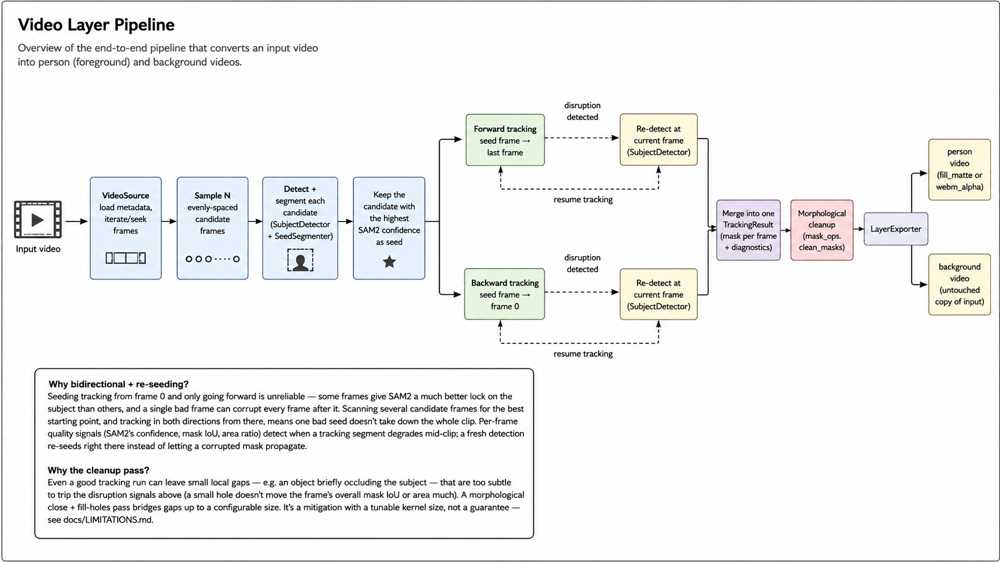
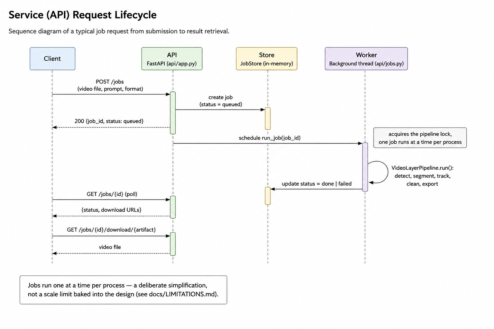

# video-layer-service

Detects a subject in a video (open-ended text prompt — "person", "guitarist",
or any object), segments and tracks it across every frame, and exports two
stackable output videos: a **person** layer and a **background** layer. see
[`docs/LIMITATIONS.md`](docs/LIMITATIONS.md) for the full scope and known
gaps, and [`docs/ARCHITECTURE.md`](docs/ARCHITECTURE.md) for how the pieces
fit together.

## How it works

Grounding DINO (open-vocabulary detection) finds the subject; SAM2 segments
it; a bidirectional SAM2 video tracker (seeded from whichever sampled frame
gives the highest confidence, propagating both forward and backward, with
automatic re-detection if tracking quality craters) follows it across every
frame; a morphological cleanup pass closes small occlusion gaps; the result
is exported as two videos.





## Install

```bash
pip install -r requirements.txt
```

Also requires `ffmpeg` on `PATH` — every export format encodes through it.
On macOS: `brew install ffmpeg`.

## Run it

### Option A — direct CLI (single video, one process, no server)

```bash
./scripts/run_pipeline.sh tests/fixtures/short_clip.mp4 \
  --prompt "person" --output-dir out/ --person-format matte
```

Or without the wrapper script:

```bash
python -m pipeline tests/fixtures/short_clip.mp4 \
  --prompt "person" --output-dir out/ --person-format matte
```

Flags:

| Flag | Default | Notes |
|---|---|---|
| `--person-format {matte,fill_matte,webm_alpha}` | `matte` | `matte` emits only the silhouette |
| `--num-seed-candidates` | `12` | stops early once a candidate scores ≥ 0.97 |
| `--mask-close-kernel-size` | `7` | large values bridge arm-to-torso gaps and fill them solid |
| `--feather-sigma` | `1.0` | gaussian edge feather in px; `0` disables |
| `--temporal-smoothing` | off | 3-tap median across frames; removes edge jitter, costs a frame of lag |
| `--max-segments-per-direction` | `20` | re-seed budget |
| `--max-segment-frames` | `600` | caps VRAM growth (~18 MB/frame, never evicted) |
| `--cpu-offload` | off | session state in host RAM; removes the frame ceiling, ~22% slower |
| `--model-size {large,base-plus,small,tiny}` | `large` | smaller is faster and measurably less accurate |

### Option B — FastAPI service (local)

```bash
./scripts/run_api.sh
```

Starts the API on `http://localhost:8000`. Submit a job:

```bash
curl -X POST http://localhost:8000/jobs \
  -F "video=@tests/fixtures/short_clip.mp4" \
  -F "prompt=person" \
  -F "person_format=fill_matte"
# => {"job_id": "...", "status": "queued"}
```

Poll for status:

```bash
curl http://localhost:8000/jobs/<job_id>
# => {"job_id": "...", "status": "done", "person_url": "/jobs/.../download/person",
#     "matte_url": "/jobs/.../download/matte", "background_url": "/jobs/.../download/background"}
```

Download a finished artifact:

```bash
curl -o person.mp4 http://localhost:8000/jobs/<job_id>/download/person
```

Jobs run **one at a time per process** — a submission while another job is
running just waits its turn (see `api/jobs.py`). A single run took ~35
minutes of actual processing on an Apple M1 Pro (no CUDA); expect a real GPU
to be meaningfully faster, and expect runtime to scale with clip length.
Poll, don't wait on an open connection.

### Option C — Docker

```bash
./scripts/run_docker.sh
```

Builds the image and runs it on port 8000, with `./data/jobs` mounted so
uploads/outputs survive a container restart. CPU-only by default. Verified
end to end: builds cleanly (~3.3GB content, ~9.3GB on disk — the default
pip `torch` wheel bundles full CUDA runtime libs even for CPU-only use),
serves `/health`, and a real job (detect → track → export) completes
correctly through the containerized API. For GPU: swap in a CUDA-enabled
`torch` install and run the container with `--gpus all` (not set up or
tested — no CUDA-capable GPU available to validate it against).

## Output formats

- **`matte`** (default): one grayscale H.264 video (`person_matte.mp4`, white
  = subject), encoded at CRF 18 with `-tune grain` — which measures ~3.2 dB
  better than plain CRF 18 on a hard-edged matte, because `grain` disables
  the psychovisual and deblocking behaviour that smears sharp edges.
  This is all a compositor needs: the subject's *colour* is the source video
  the consumer already has, so a cut-out copy of it plus a byte-identical
  "background" is pure egress. Roughly **2.5 MB per minute**. It is also the
  only format with no dark rim (see `fill_matte` below).
- **`fill_matte`**: two H.264 videos — the person on black
  (`person_fill.mp4`) and a grayscale matte (`person_matte.mp4`). Combine
  them with a standard **track matte / luma matte** operation — a built-in
  effect in Premiere Pro ("Track Matte Key") and DaVinci Resolve ("Composite
  Using Matte"), or `ffmpeg -i fill.mp4 -i matte.mp4 -filter_complex
  alphamerge out.mov` in code.
  **Known rim:** zeroing the non-subject pixels creates a maximal-contrast
  black step exactly on the silhouette, and lossy 4:2:0 encoding then bleeds
  that black 1–3 px *into* the subject through chroma subsampling and DCT
  ringing. Raising the encoder from `mp4v` to H.264 CRF 18 shrinks it
  substantially but cannot remove it — it is inherent to the format. Use
  `matte` if that matters.
- **`webm_alpha`**: one file (`person.webm`) with a true alpha channel
  (VP9/yuva420p). Only use this if the downstream consumer has *confirmed*
  it decodes VP9 alpha correctly — plain `ffmpeg -i person.webm` (the
  default almost everything uses) silently reports it as fully opaque
  instead of erroring. See `exporter.py`'s docstring for why.
- **`background`**: always the untouched original input video, byte-for-byte
  — no re-encoding, no person removed/inpainted.

## Testing

```bash
python -m unittest discover -s tests -t .
```

Most of this suite (data types, mask ops, video I/O, detector logic,
exporter — including a real ffmpeg encode/decode round-trip) is fully
offline: no model downloads, no GPU, runs in well under a second.
**`test_api.py` is the exception** — it runs the *real* pipeline (real
Grounding DINO + real SAM2) against a trimmed 29-frame fixture clip
(`tests/fixtures/short_clip.mp4`), so the whole discover run takes ~1-2
minutes rather than being instant, and needs the models downloaded/cached at
least once first.

For a full end-to-end run against actual models, printing diagnostics for a
human to sanity-check:

```bash
python -m smoke_test [optional_path_to_a_real_video]
```

Runs against the bundled fixture clip by default. Downloads
`grounding-dino-base` and `sam2.1-hiera-large` on first run (~1.8GB
combined).
