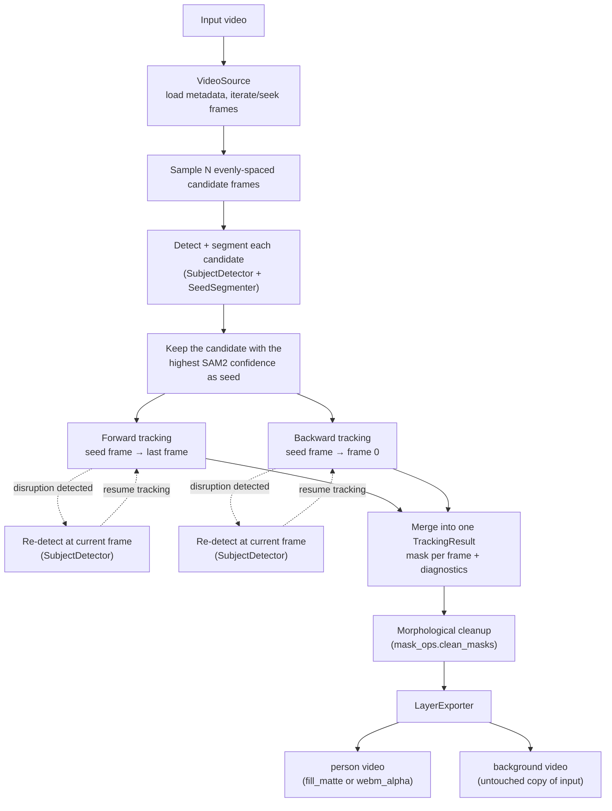

# Architecture

## Pipeline



**Why bidirectional + re-seeding:** seeding tracking from frame 0 and only
going forward is unreliable — some frames give SAM2 a much better lock on
the subject than others, and a single bad frame can corrupt every frame
after it. Scanning several candidate frames for the best starting point, and
tracking in both directions from there, means one bad seed doesn't take down
the whole clip. Per-frame quality signals (SAM2's own confidence, mask IoU,
area ratio) detect when a tracking segment degrades mid-clip; a fresh
detection re-seeds right there instead of letting a corrupted mask
propagate.

**Why the cleanup pass:** even a good tracking run can leave small local
gaps — e.g. an object briefly occluding the subject — that are too subtle to
trip the disruption signals above (a small hole doesn't move the frame's
overall mask IoU or area much). A morphological close + fill-holes pass
bridges gaps up to a configurable size. It's a mitigation with a tunable
kernel size, not a guarantee — see `docs/LIMITATIONS.md`.

## Service (API) request lifecycle

```mermaid
sequenceDiagram
    participant Client
    participant API as FastAPI (api/app.py)
    participant Store as JobStore (in-memory)
    participant Worker as Background thread (api/jobs.py)

    Client->>API: POST /jobs (video file, prompt, format)
    API->>Store: create job (status=queued)
    API-->>Client: 200 {job_id, status: queued}
    API->>Worker: schedule run_job(job_id)

    Note over Worker: acquires the pipeline lock —<br/>one job runs at a time per process
    Worker->>Worker: VideoLayerPipeline.run()<br/>detect &rarr; segment &rarr; track &rarr; clean &rarr; export
    Worker->>Store: update status = done | failed

    Client->>API: GET /jobs/{id} (poll)
    API-->>Client: {status, download URLs}

    Client->>API: GET /jobs/{id}/download/{artifact}
    API-->>Client: video file
```

Jobs run one at a time per process — a deliberate simplification, not a
scale limit baked into the design (see `docs/LIMITATIONS.md`).

## Module map

| File | Responsibility |
|---|---|
| `datatypes.py` | Shared dataclasses passed between stages (`BoundingBox`, `VideoMetadata`, `SeedFrame`, `TrackingResult`, `TrackerConfig`, `ExportResult`) |
| `device.py` | Picks `cuda` / `mps` / `cpu` |
| `video_source.py` | Opens/reads the input video; the empirically-measured frame count, not the (unreliable) container header value |
| `detector.py` | Grounding DINO — open-vocabulary detection, largest-area box wins |
| `segmenter.py` | SAM2 image model — segments a box into a mask; scans candidate frames to pick the tracking seed |
| `mask_ops.py` | Pure functions: mask IoU, morphological cleanup, disruption predicate |
| `tracker.py` | SAM2 video model — bidirectional tracking with auto re-seeding |
| `exporter.py` | Encodes the final person + background videos |
| `pipeline.py` | Orchestrates all of the above; also the CLI entry point |
| `api/app.py` | FastAPI routes |
| `api/jobs.py` | Job state + the background worker that runs the pipeline |
